# Игра "Угадай число"

Тестовое задание в Solvatech Laboratory 3.0

<p align="center">
  
</p>

В этом проекте реализована кроссплатформенная мобильная игра «Угадай число», в которой система генерирует случайное число, а у пользователя есть ограниченное количество попыток его угадать.

## Функционал

- Настраиваемый диапазон генерируемых чисел и попыток
- Автоматическая проверка вводимых пользователем данных
- Возможность просмотра подсказок
- История игр

## Как играть

- Введите максимальное генерируемое число и количество попыток.
- Нажмите кнопку "Начать игру".
- Диапазон генерируемых чисел и количество оставшихся попыток будет отображено наверху экрана.
- Попробуйте угадать сгенерированное число, введя ваш ответ в поле "Ваша догадка" и нажав кнопку "Проверить".
- Проверенные числа отображаются снизу экрана (до 100 чисел). Вы можете нажать на проверенное число что бы установить его в поле "Ваша догадка" для быстрого редактирования.
- Активировав "подсказки", проверенные числа окрашиваются в синий цвет если догадка меньше сгенерированного числа, и в красный если больше. Чем ближе ваш ответ, тем четче будет видно число.
- При желании можно включить или отключить генерацию случайного числа после проверки для поля "Ваша догадка".
- Если вы угадаете число, или закончатся попытки, появится всплывающее окно с результатом игры. Нажмите кнопку "Начать игру заново" что бы перезапустить игру с теми же параметрами, или нажмите на стрелку назад или мимо всплывающего окна что бы вернуться в меню.
- Каждая игровая сессия записывается, и результат виден в секции "История", которую можно очистить. Матч с ипользованными подсказками отображается отдельно.

## Скриншоты

<details><summary><b>Material Design</b></summary>
   <table>
   <tr>
      <th>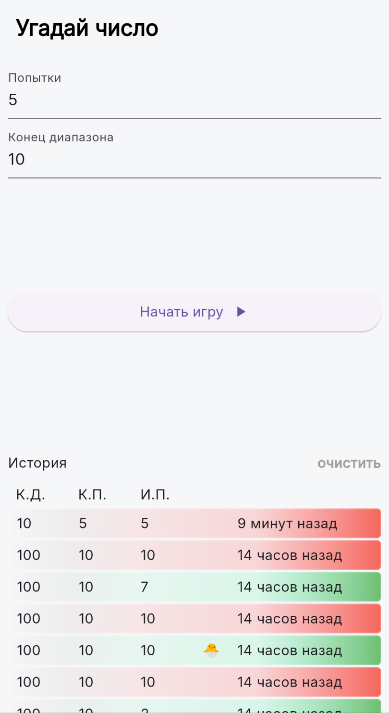</th>
      <th>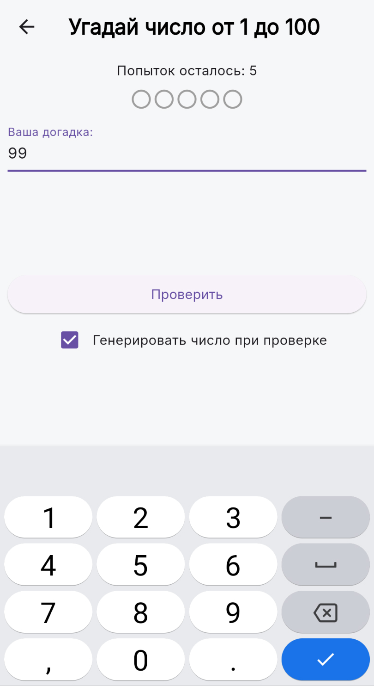</th>
      <th>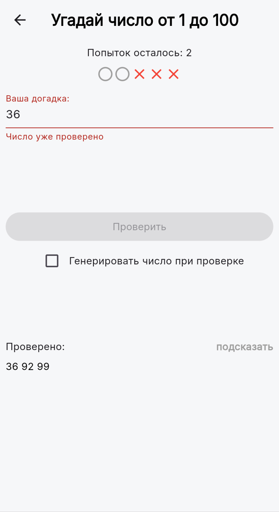</th>
   </tr>
   <tr>
      <th>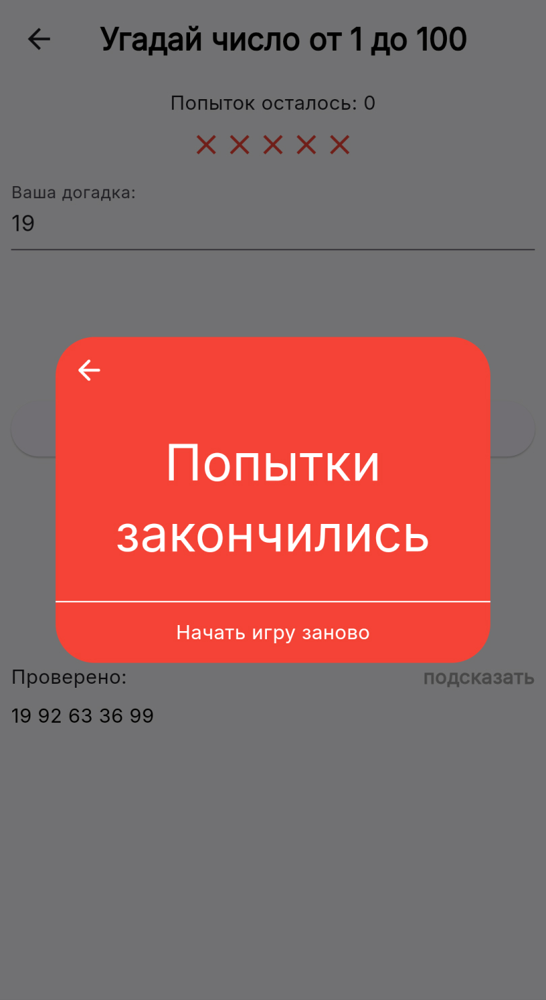</th>
      <th>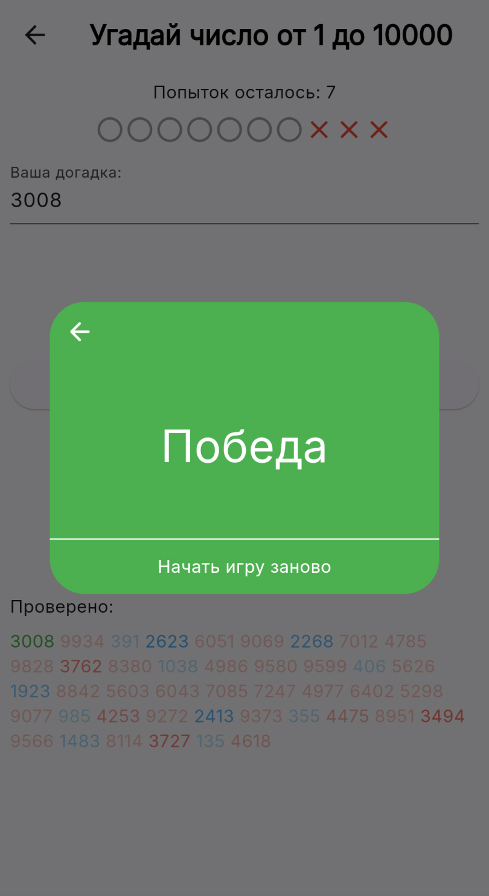</th>
      <th>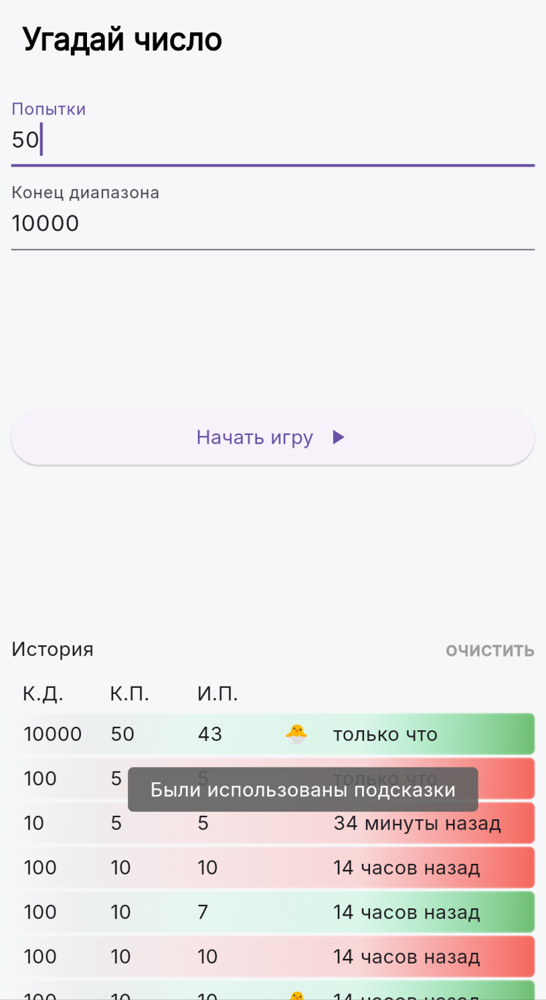</th>
   </tr>
   </table>
</details>
<details><summary><b>Cupertino</b></summary>
   <table>
   <tr>
      <th>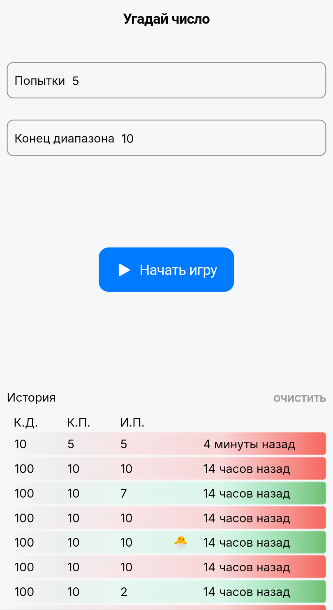</th>
      <th>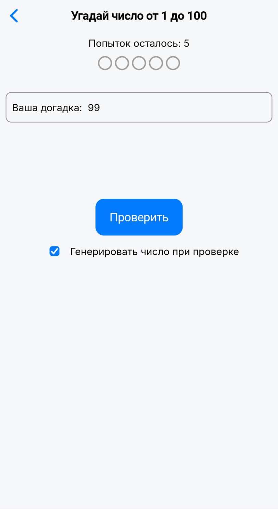</th>
      <th>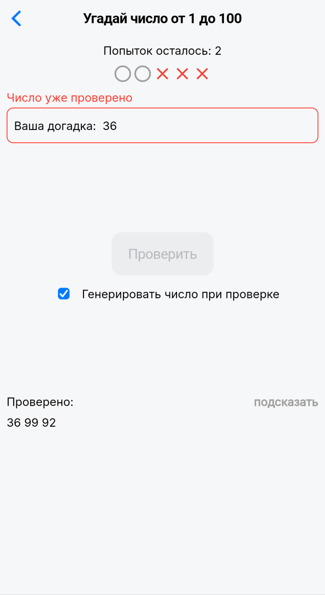</th>
   </tr>
   <tr>
      <th>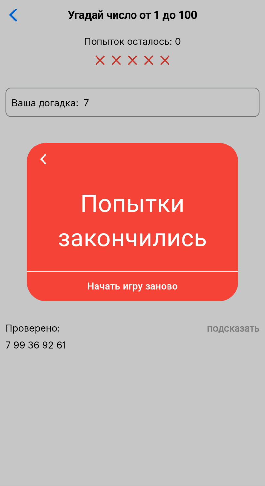</th>
      <th>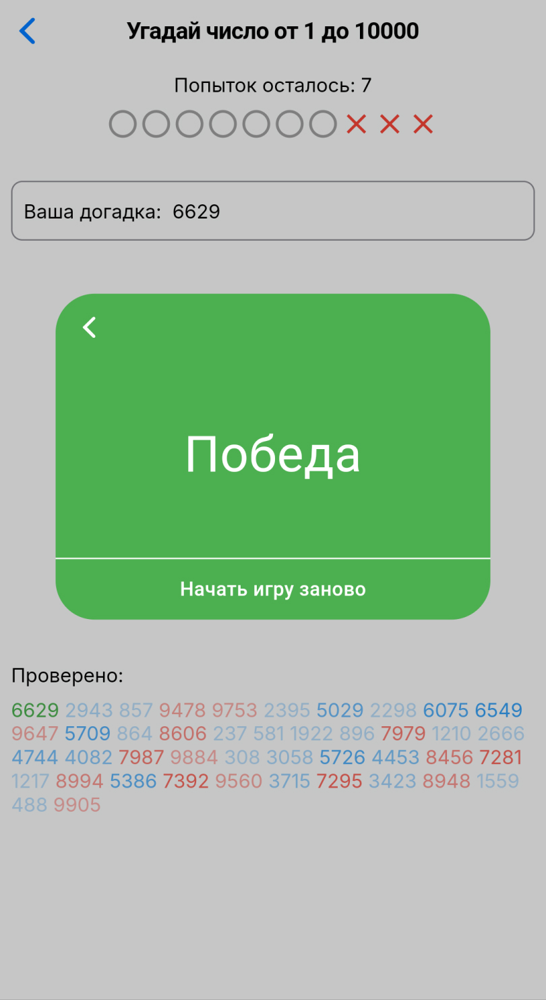</th>
      <th>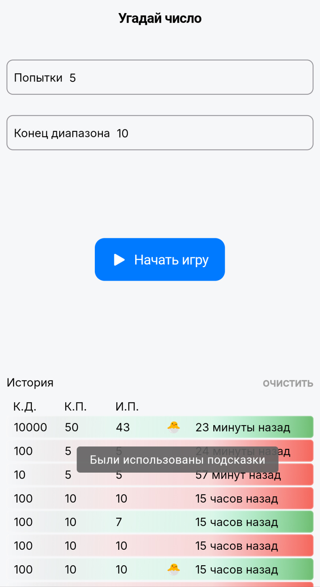</th>
   </tr>
   </table>
</details>

---

## Установка

Выполните следующие шаги, чтобы запустить приложение:

### Предварительные условия

Прежде чем приступить, убедитесь, что у вас установлено следующее:

##### **Flutter SDK**

Скачайте и установите Flutter SDK с [официального сайта](https://docs.flutter.dev/get-started/install).

##### **Android Studio или Visual Studio Code**

Установите одну из этих IDE для разработки:

- [Android Studio](https://developer.android.com/studio)
- [Visual Studio Code](https://code.visualstudio.com/)

Убедитесь, что у вас установлены необходимые плагины:

- Flutter
- Dart

##### **Устройство или эмулятор**.

- Подключите физическое устройство через USB с включенной отладкой по USB.
- Или настройте эмулятор в Android Studio или iOS Simulator (для macOS).

### 1. Клонируйте репозиторий

Клонируйте репозиторий на локальную машину с помощью Git:

```bash
git clone https://github.com/raimkulovr/guess_the_number.git
cd guess_the_number
```

### 2. Установка зависимостей

Выполните следующую команду для установки зависимостей:

```bash
flutter pub get
```

### 3. Запуск приложения

1. Убедитесь, что устройство или эмулятор подключены:

   ```bash
   flutter devices
   ```
2. Запустите приложение:

   ```bash
   flutter run
   ```

#### Устранение неполадок

Если у вас возникли проблемы, выполните команду:

```bash
flutter doctor
```

Эта команда выведет список отсутствующих зависимостей или конфигураций.

---

## Загрузка APK (необязательно, Android)

Если вы не хотите "собирать" приложение самостоятельно, вы можете скачать готовый файл `.apk` и установить его прямо на свое Android-устройство.

Посетите раздел **Releases** этого репозитория, чтобы загрузить последний файл `.apk`:
[Скачать APK с GitHub Releases](https://github.com/raimkulovr/guess_the_number/releases)
